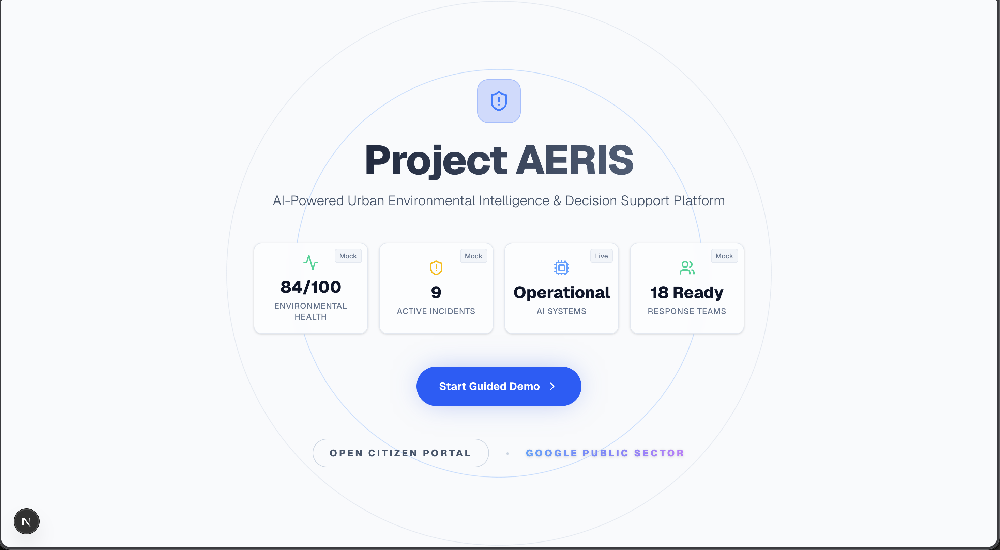
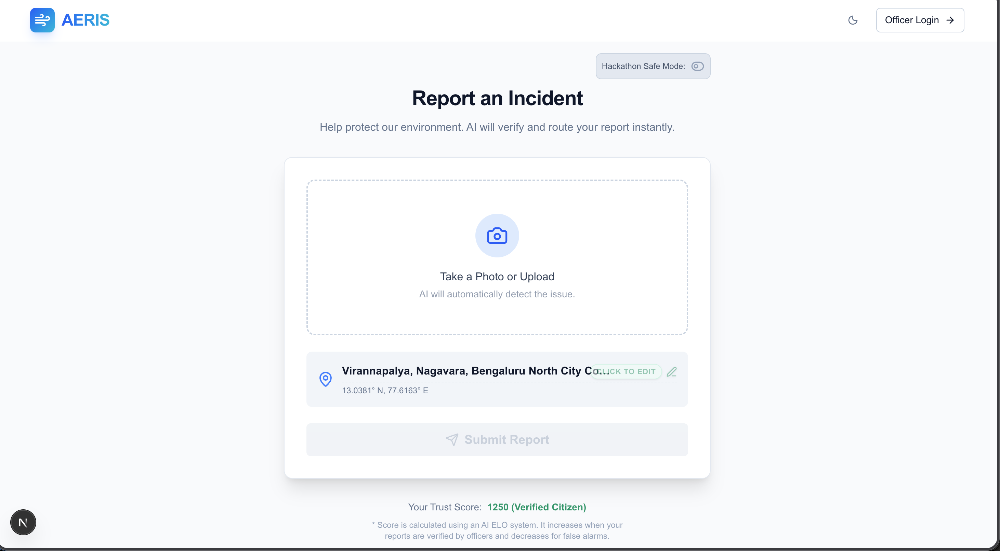
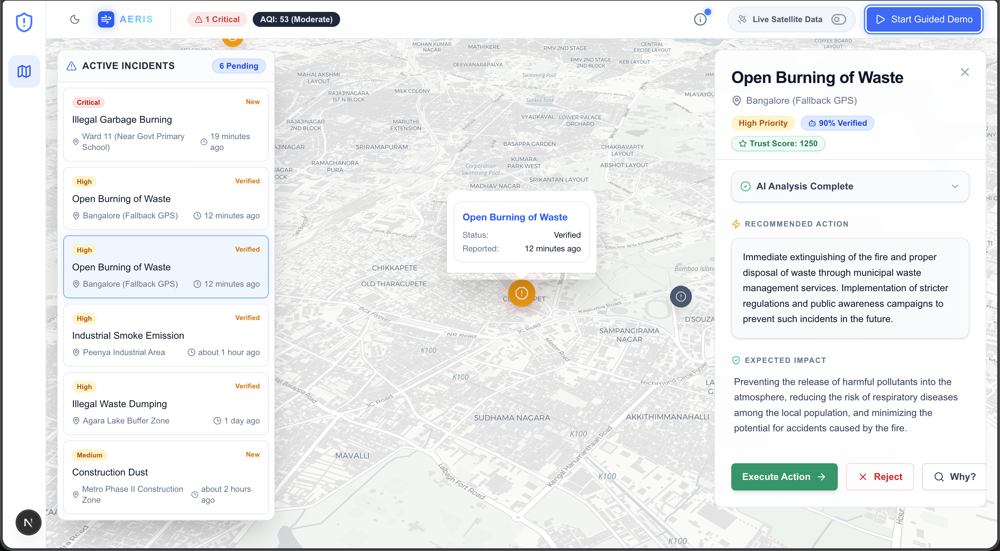
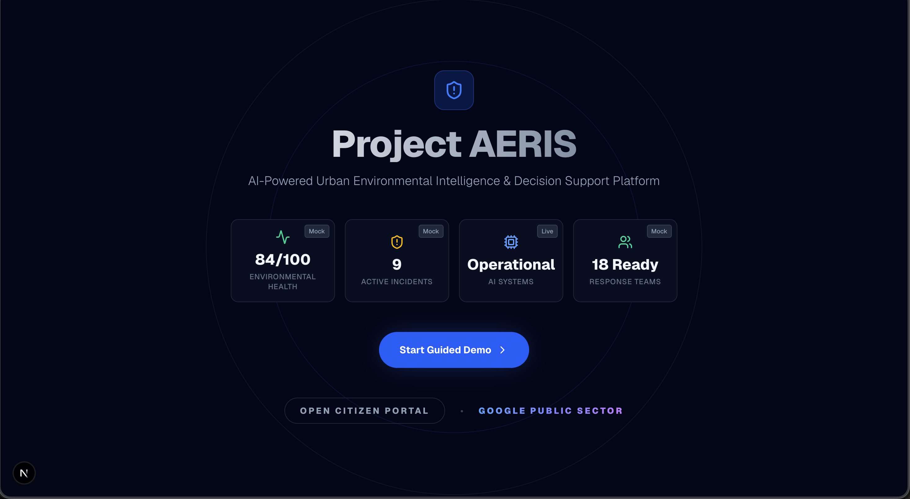
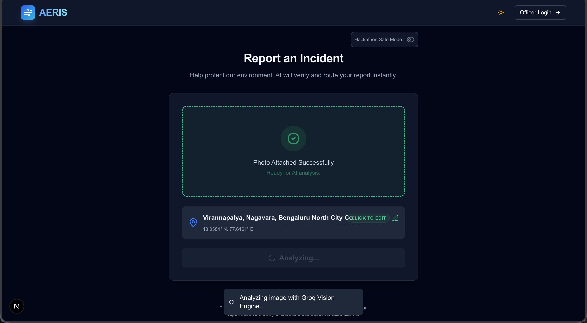
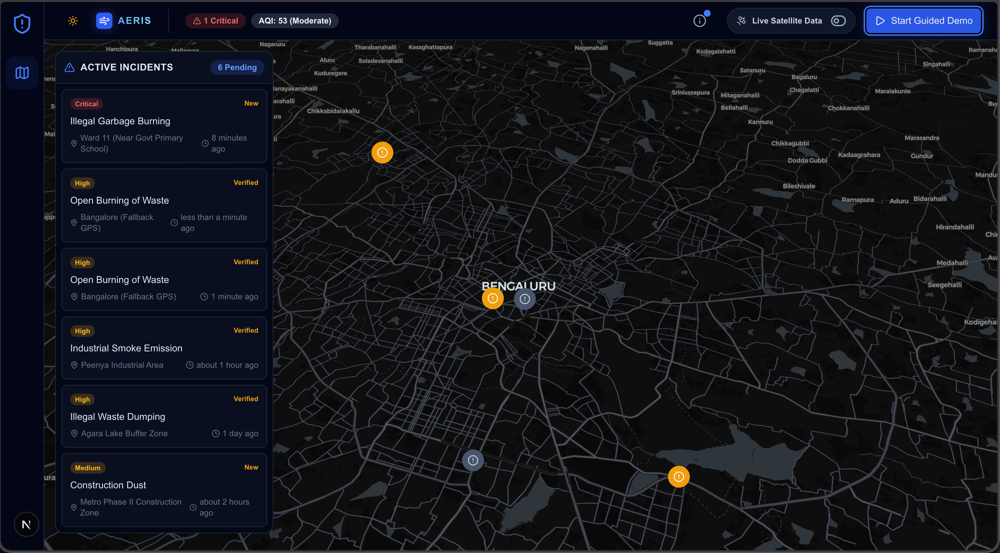
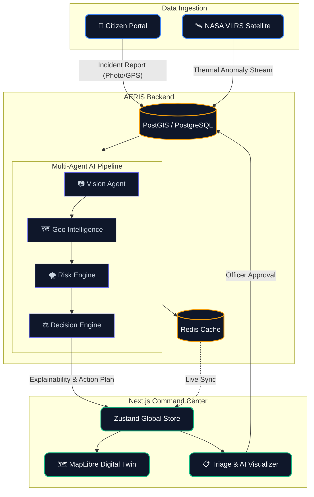

<div align="center">
  
  <h1>Project AERIS</h1>
  <p><strong>AI-Powered Urban Environmental Intelligence & Decision Support Platform</strong></p>
  <p>
    <a href="#problem">Problem</a> • 
    <a href="#solution">Solution</a> • 
    <a href="#architecture">Architecture</a> • 
    <a href="#ai-pipeline">AI Pipeline</a> • 
    <a href="#tech-stack">Tech Stack</a>
  </p>
</div>

---

## 🌪️ The Problem

Every year, municipalities lose millions of dollars and compromise the health of hundreds of thousands of citizens due to delayed responses to localized environmental incidents (e.g., illegal industrial dumping, hazardous fires, chemical spills).

Traditional city dashboards are **reactive, fragmented, and passive**. They show raw data on a map, but they don't tell command center officers *what to do*, *why it matters*, or *how to respond*. The cognitive load during a crisis falls entirely on understaffed dispatchers.

## 🚀 The Solution: Project AERIS

Project AERIS is a proactive **Environmental Command Center**. It transforms raw citizen reports and IoT data into verifiable, actionable intelligence using an autonomous multi-agent AI architecture.

AERIS doesn't just put a pin on a map. It answers the only question that matters in a crisis: **"What should we do next?"**

### Key Features
- **Deterministic Multi-Agent Pipeline:** Orchestrates specialized AI agents (Vision, Geo, Risk, Decision) to verify incidents and formulate response plans.
- **Explainability Engine (CoT):** Generates transparent "Chain of Thought" reasoning for every AI recommendation, ensuring Human-in-the-Loop (HITL) trust.
- **Citizen Trust ELO:** Dynamically scores reporter credibility to filter out noise and prioritize verified crises.
- **Geospatial Digital Twin:** Real-time MapLibre integration with predictive Risk Cone simulations.
- **Zero-Latency UI:** Built with Next.js, Zustand, and Tailwind for a butter-smooth Command Center experience.

---

## 📸 Screenshots

### Light Theme
| Mission Control Landing | Citizen Reporting Portal | Command Center (Live Map) |
| :---: | :---: | :---: |
|  |  |  |

### Dark Theme
| Mission Control Landing | Citizen Reporting Portal | Command Center (Live Map) |
| :---: | :---: | :---: |
|  |  |  |

---

## 🧠 The AI Pipeline

AERIS operates on a specialized multi-agent architecture to guarantee deterministic, high-confidence outputs.

1. **📷 Vision Agent:** Analyzes raw media (e.g., citizen photos of smoke or chemical spills) to verify the physical presence of a hazard.
2. **🗺️ Geo Intelligence:** Triangulates the incident against vulnerable municipal assets (schools, hospitals, water plants).
3. **🌪️ Risk Engine:** Calculates time-decaying risk vectors and simulates physical propagation (e.g., wind carrying smoke, water carrying chemicals).
4. **⚖️ Decision Engine:** Synthesizes the data into a concrete, executable recommended action (e.g., "Dispatch Hazmat Unit Alpha").
5. **🔍 Explainability Engine:** Wraps the entire process in a human-readable Chain of Thought trace for auditability.

---

## 🏗️ Architecture & Tech Stack

AERIS is designed for production-grade municipal deployments: highly modular, scalable, and cloud-native.



### Frontend (Command Center)
- **Framework:** Next.js 14 (App Router), React
- **Language:** TypeScript
- **State Management:** Zustand
- **Styling:** Tailwind CSS, Shadcn/UI, Framer Motion
- **Geospatial:** MapLibre GL, react-map-gl

### Backend (Intelligence Engine)
- **Framework:** FastAPI (Python 3.11+)
- **Database:** PostgreSQL with PostGIS extension (Geospatial querying)
- **Caching:** Redis (Rate limiting & fast-path state)
- **AI Integration:** Google Gemini APIs (Structured JSON output via specialized agents)

### DevOps & Deployment
- **Containerization:** Docker & Docker Compose
- **Hosting Target:** Google Cloud Run (Frontend & Backend)
- **Database Target:** Google Cloud SQL (PostgreSQL)

---

## 🎮 Demo

### Running Locally
To launch the entire stack locally for development or judging:

```bash
# Clone the repo
git clone https://github.com/Kiruthick7/Project_AERIS.git
cd Project_AERIS

# Launch Backend & Databases
docker-compose up -d

# Launch Frontend Command Center
cd frontend
npm install
npm run dev
```

Navigate to `http://localhost:3000` to access the Mission Control Landing.

---

## 🔮 Future Scope

While AERIS is highly capable today, the roadmap for V2 includes:
- **IoT Integration:** Direct ingestion pipelines for hyper-local air quality sensors and river flow meters.
- **Drone Dispatch Integration:** Automated API hooks to launch municipal recon drones to unverified incident coordinates.
- **Predictive Maintenance:** Analyzing historical incident clusters to recommend preventative infrastructure upgrades.
- **Multi-lingual Citizen Portal:** Ensuring accessibility for diverse urban populations using LLM-driven real-time translation.

---
<div align="center">
  <i>Built with ❤️ for Build With AI: Code for Communities</i>
</div>
